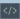

I was raised in the small town of Colchester, where my programming adventure started during an apprenticeship. Focusing on front-end development and assisting in creating full-fledged WordPress websites, I found my love for problem-solving and building applications from the ground up.

After 4 years, I craved something new and moved away from web development. Pursing new career options, I enrolled in the University of Lincoln to obtain my BSc degree in Computer Science. In between assignments, I began taking online Udacity and Udemy courses, where I discovered a passion for Machine Learning and AI.

I continued my journey through an MSc degree in Machine Learning and Autonomous Systems at the University of Bath.

Personally, I love programming  and playing chess , and enjoy listening to music  or watching a movie  when relaxing.

Currently, I spend most of my time building tools in Python and exploring research in Deep Learning, primarily in locomotion and small-scale models. I strongly believe that models should be small and powerful, not large and powerful. I aim to help make that a reality.
